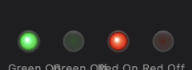

# BusyLight 🟢🔴

macOS 菜单栏 CPU / GPU 负载指示灯。高负载时红灯呼吸，恢复正常后强提醒。



## 功能

- **实时监控**：每 2 秒采样 CPU（`host_statistics`）和 GPU（IOKit IOAccelerator）使用率
- **红灯呼吸**：CPU > 65% 或 GPU > 70% → 菜单栏红灯呼吸动画（消抖 3 次 / 6 秒）
- **绿色静态**：负载正常 → 绿色常亮
- **强提醒**：红灯持续 ≥ 1 分钟后恢复绿色时触发：
  - 🔊 清脆提示音 3 连响（"Glass" 系统音效，满音量）
  - 🔔 系统通知横幅 "High load has ended"
- **菜单信息**：点击菜单栏图标查看实时 CPU / GPU 百分比

## 安装

### 直接下载

从 [Releases](../../releases) 下载 `BusyLight.app`，拖入 `/Applications` 运行。

### 从源码构建

```bash
git clone https://github.com/aqiqiaoqiao/BusyLight.git
cd BusyLight
bash build.sh --run
```

> 需要 Xcode 或 Swift 5.9+ 命令行工具。构建产物在 `dist/BusyLight.app`。

## 技术栈

- Swift 5.9 / AppKit
- macOS 13+（Apple Silicon / Intel）
- IOKit（GPU 性能统计）
- UserNotifications（系统通知）
- SPM 构建

## 项目结构

```
Sources/BusyLight/
├── main.swift              # 入口（.accessory 激活策略，无 Dock 图标）
├── AppDelegate.swift       # 状态栏、菜单、呼吸动画、提示音/通知
├── MonitorEngine.swift     # CPU/GPU 轮询引擎 + 消抖
└── LightView.swift         # Core Graphics 径向渐变图标
Scripts/
└── generate_icon.swift     # 运行时生成 app icon
build.sh                    # 一键构建 + .app 打包
```

## 工作原理

```
MonitorEngine (2s 轮询)
    │
    ├─ CPU: host_statistics() → 用户+系统+空闲 tick 差值
    ├─ GPU: IOKit IOAccelerator → "Device Utilization %"
    │
    ▼
AppDelegate.stateChanged()
    │
    ├─ busy → startBreathing()  (fade-in 0.5s → hold 0.5s → fade-out 0.5s)
    ├─ idle → stopBreathing()   (静态绿色图标)
    └─ red≥1min→green → playAlertSound() + postAlertNotification()
```

## License

MIT
